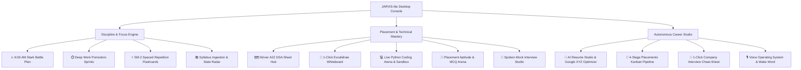

# ⚡ JARVIS-lite // Neural Engineering & Career Console

> **An offline, autonomous AI desktop companion engineered for computer science students to eliminate daily task paralysis, build unshakeable study discipline, and accelerate campus placements.**

Built with **Python**, **CustomTkinter**, **Local Ollama (`llama3.1:8b`)**, **SQLite**, and **Windows Speech APIs (STT / SAPI5 TTS)** — 100% private, zero cloud subscriptions.

---

## 🌟 Key Capabilities & Architecture



---

### 1. ⚔️ Stark Battle Plan & Daily Accountability
- **3-Target Daily Protocol**: Eliminates decision fatigue with 1 DSA coding target, 1 stale CS revision target (>3 days untouched in SQLite), and 1 urgent placement deliverable.
- **🌙 Evening Debrief**: Compiles daily execution telemetry (0–100%) and has JARVIS deliver a spoken British audio evaluation grading your discipline.

### 2. 🗺️ Striver DSA Sheet & Voice Dry-Run Journal
- Direct links to **LeetCode**, **Coding Ninjas (Code360 by Naukri)**, and verified **Striver YouTube solutions**.
- **🎨 1-Click Excalidraw Launcher**: Diagram pointers, arrays, and tree recursion visually while coding.
- **🎙️ Explain Aloud (Voice Practice)**: Speak your intuition and dry-run into the mic like in a real FAANG interview. Local Ollama synthesizes permanent structured notes (Intuition, Dry-Run steps, Big-O, Edge Cases) and scores your verbal clarity (1–10).
- **🔊 1-Minute Audio Revision**: In 3 weeks, never rewatch a 40-minute video; JARVIS reads your personal dry-run into your headphones in 30 seconds.

### 3. ⏱️ Stark Deep Work Pomodoro Engine
- Top HUD timer badge (`⏱️ 25:00 [Active]`) with live countdown.
- Audio chimes, native Windows desktop toasts, and automatic study hours logging into SQLite (`[X.Xh Today]`).

### 4. 🧮 Campus Placement Aptitude & Core CS Arena
- 60-second speed drill simulator testing Quantitative Aptitude and Core CS (OS Deadlocks/Paging, DBMS B+ Trees/ACID, Networks TCP/IP, C pointers).
- Step-by-step mathematical derivations and real-time database accuracy tracking.

### 5. 💻 Coding Arena & Sandboxed Execution
- Local subprocess Python code runner with stdout/stderr capture and 5-second timeout protections.
- AI Code Reviewer calculating exact Big-O Time & Space complexities, edge case vulnerabilities, and optimizations.

### 6. 🎯 Mock Interview Studio & Hands-Free Drill
- Technical interviews across DSA, OS, DBMS, Networks, and System Design.
- **🎙️ Hands-Free Spoken Drill**: Continuous voice loop where JARVIS speaks the question, listens to your mic for up to 20s, evaluates your response (1–10), and speaks back your score and critique aloud.

### 7. 💼 Placements Kanban & 1-Click Company Cheat Sheet
- 4-Stage visual board: `Applied` ➔ `OA` ➔ `Technical Interview` ➔ `Offer Received`.
- **📑 Company Cheat Sheet**: Generates high-density, printable A4 HTML briefs (`exports/cheatsheet_<company>.html`) with company questions, project pitch, Big-O table, and core CS review.

### 8. 📄 AI Resume Studio
- **Google XYZ Bullet Optimizer**: Formats bullets into *"Accomplished [X], measured by [Y], by doing [Z]"*.
- **JD Gap Analyzer**: Computes keyword match % against job descriptions and syncs missing skills to your Study Tracker.
- 1-Click export to clean, printable HTML resumes.

### 9. 🎙️ Voice OS & Hands-Free Navigation
- Speak directly to JARVIS: *"Open striver sheet"*, *"Open coding arena"*, *"Start focus timer"*, *"Open battle plan"*, *"Launch Excalidraw"*.
- Background "Hey Jarvis" wake-word listener with British Hazel / US Zira voice options.

---

## 🛠️ Quick Start & Installation

### Prerequisites
- Python 3.10+
- [Ollama](https://ollama.com/) running locally with the `llama3.1:8b` model:
  ```bash
  ollama run llama3.1:8b
  ```

### Installation
1. Clone the repository:
   ```bash
   git clone https://github.com/Vecodesh/jarvis-lite.git
   cd jarvis-lite
   ```
2. Set up virtual environment and install dependencies:
   ```bash
   python -m venv .venv
   .\.venv\Scripts\pip install -r requirements.txt
   ```
3. Launch JARVIS-lite:
   ```bash
   .\.venv\Scripts\python.exe src/gui.py
   ```

---

## 🔒 Privacy & Architecture
- **Zero Cloud Dependence**: 100% of LLM inference, speech synthesis, and database operations run on your local machine.
- **Data Persistence**: Local SQLite (`database/assistant.db`) across 14 tables with 1-click JSON/CSV backups.

---
*Created by [Vecodesh](https://github.com/Vecodesh) // Engineered for Placement Excellence.*
